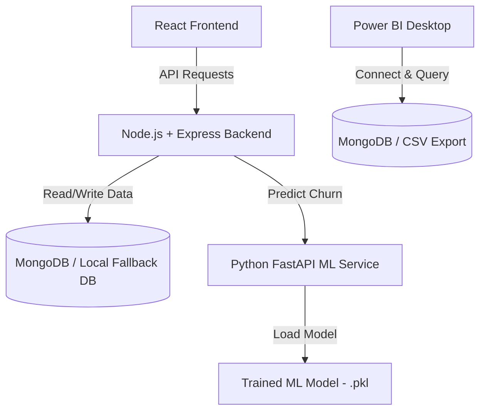

# Implementation Plan - Telecom Churn Prediction & Power BI Dashboard

This project is a full-stack Customer Churn Prediction system with an AI-driven React Dashboard, a Node.js/Express Backend, a Python ML Service (FastAPI), and a Power BI template.

---

## Architecture Overview

---

## User Review Required

> [!IMPORTANT]
> **Python Environment**: Since a Python installation is not registered in the system's global `PATH`, the Node.js backend will use a **built-in smart heuristic model** for predictions if it cannot connect to the Python ML Service. This ensures the app is fully functional out-of-the-box.
> **MongoDB Database**: The Node.js backend will attempt to connect to MongoDB. If MongoDB is not running or not configured, it will fall back to a local JSON database file (`server/uploads/local_db.json`) so the dashboard and tables load seamlessly without requiring database setup.

---

## Proposed Changes

### Component 1: ML Service (Python FastAPI)

This service loads a trained machine learning model and returns predictions and feature importances.

#### [NEW] [requirements.txt](file:///c:/Users/DURGAI/Desktop/Customer%20Churn%20Prediction%20+%20Power%20BI%20Dashboard/ml-service/requirements.txt)
- Lists Python dependencies: `fastapi`, `uvicorn`, `scikit-learn`, `pandas`, `numpy`, `joblib`, `pydantic`.

#### [NEW] [train.py](file:///c:/Users/DURGAI/Desktop/Customer%20Churn%20Prediction%20+%20Power%20BI%20Dashboard/ml-service/train.py)
- Generates a synthetic but highly realistic Telecom Churn dataset (e.g. contract type, tenure, monthly charges, paperless billing, internet service type).
- Trains a Random Forest Classifier.
- Saves the trained model and scaler to the `saved_model/` directory.

#### [NEW] [app.py](file:///c:/Users/DURGAI/Desktop/Customer%20Churn%20Prediction%20+%20Power%20BI%20Dashboard/ml-service/app.py)
- Implements FastAPI server (default port `8000`).
- `/predict`: Accepts customer JSON payload, extracts features, normalizes them, and returns churn prediction probability, status, and explanation.
- `/train`: Endpoint to retrain model.

---

### Component 2: Node.js Backend Server

The middle tier manages users, stores customer details, prediction logs, handles CSV bulk uploads, and serves dashboard statistics.

#### [NEW] [package.json](file:///c:/Users/DURGAI/Desktop/Customer%20Churn%20Prediction%20+%20Power%20BI%20Dashboard/server/package.json)
- Configures scripts and dependencies: `express`, `mongoose`, `cors`, `dotenv`, `jsonwebtoken`, `bcryptjs`, `multer`, `csv-parser`.

#### [NEW] [app.js](file:///c:/Users/DURGAI/Desktop/Customer%20Churn%20Prediction%20+%20Power%20BI%20Dashboard/server/app.js)
- Initializes the Express app, middleware (CORS, parser, uploads directory), and routes.

#### [NEW] [server.js](file:///c:/Users/DURGAI/Desktop/Customer%20Churn%20Prediction%20+%20Power%20BI%20Dashboard/server/server.js)
- Launches the Express listener. Sets fallback connections for MongoDB and Python ML Service.

#### [NEW] [db.js](file:///c:/Users/DURGAI/Desktop/Customer%20Churn%20Prediction%20+%20Power%20BI%20Dashboard/server/config/db.js)
- Mongoose setup with an automatic fallback to local JSON database handler.

#### [NEW] [Models & Controllers](file:///c:/Users/DURGAI/Desktop/Customer%20Churn%20Prediction%20+%20Power%20BI%20Dashboard/server/controllers)
- `users`: Register, Login, JWT verification.
- `customers`: Retrieval, pagination, search, prediction mapping, bulk imports.
- `predictions`: Records predict history and AI confidence levels.

---

### Component 3: React Frontend (Client)

React SPA styled with **Aurora AI Light** theme (Apple + Linear style glassmorphism).

#### [NEW] [index.css](file:///c:/Users/DURGAI/Desktop/Customer%20Churn%20Prediction%20+%20Power%20BI%20Dashboard/client/src/index.css)
- Defins Aurora AI Light CSS Variables.
- Background glow animations, custom card glass styles (`.glass-card`), and custom button/sidebar transitions.

#### [NEW] [Dashboard.jsx](file:///c:/Users/DURGAI/Desktop/Customer%20Churn%20Prediction%20+%20Power%20BI%20Dashboard/client/src/pages/Dashboard/Dashboard.jsx)
- Displays KPIs (Active, Inactive, Revenue, Revenue Lost, Churn Rate).
- Interactive Recharts (Revenue trend, churn rate distribution, age, gender demographics).
- Lists top high-risk churn customers.

#### [NEW] [Prediction.jsx](file:///c:/Users/DURGAI/Desktop/Customer%20Churn%20Prediction%20+%20Power%20BI%20Dashboard/client/src/pages/Prediction/Prediction.jsx)
- Form containing fields for single customer profile prediction (Contract, Internet Service, Monthly Charges, Tenure, Tech Support, etc.).
- Animated gauge representing Churn Risk Score.
- List of features contributing to churn, with suggestions on how to retain the customer.

#### [NEW] [Customers.jsx](file:///c:/Users/DURGAI/Desktop/Customer%20Churn%20Prediction%20+%20Power%20BI%20Dashboard/client/src/pages/Customers/Customers.jsx)
- Paginated customer table with search, filter by Churn Risk, and a detailed customer side drawer.
- Support for CSV bulk import of customer data.

#### [NEW] [Authentication](file:///c:/Users/DURGAI/Desktop/Customer%20Churn%20Prediction%20+%20Power%20BI%20Dashboard/client/src/pages/Login/Login.jsx)
- Login / Register templates.

---

### Component 4: Power BI & Datasets

Assets to support reporting.

#### [NEW] [dataset/telecom_customer_churn.csv](file:///c:/Users/DURGAI/Desktop/Customer%20Churn%20Prediction%20+%20Power%20BI%20Dashboard/dataset/telecom_customer_churn.csv)
- Clean, realistic sample dataset of 1,000 customers.

#### [NEW] [powerbi/README.md](file:///c:/Users/DURGAI/Desktop/Customer%20Churn%20Prediction%20+%20Power%20BI%20Dashboard/powerbi/README.md)
- Guide on importing the data into Power BI, setting up metrics, visual configurations, and screenshots.

---

## Verification Plan

### Automated Tests
- Server startup validation: run `npm start` in the `server` directory and check port availability.
- Client startup validation: run `npm run dev` in the `client` directory.

### Manual Verification
- **Auth Flow**: Register a user, login, and confirm that token authentication is stored.
- **Dashboard Widgets**: Check KPI calculations and graph displays.
- **Form Prediction**: Input variables to predict churn and ensure the UI outputs risk levels.
- **Bulk Upload**: Import a CSV file to evaluate batch predictions.
